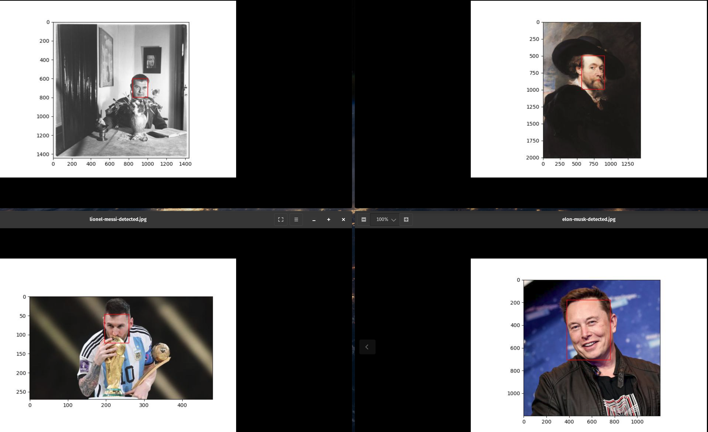

# Lab of Cloud Fundamentals AWS Sagemaker

- This is a showcase of two Machine Learning Models provided by AWS:
    1. Rekognition
        - For face detection.

    2. Polly
        - For Text to Speech translation.


## Using Amazon Rekognition

- Input:


- Output




## Steps:

- Create an AIM Role with programmatic access to the AWS Services: Rekognition, S3, and AWSLambdaExecute.
    1. AmazonS3FullAccess
    2. AmazonRekognitionFullAccess
    3. AmazonPollyFullAccess
    4. AWSLambdaExecute (if you one to run the python scripts through lambdas)


## Reproducibility

- Environment is created using conda. However, the environment file does not work properly cross-platform. Therefore we recommend using the sagemaker-test.yml file to create the conda environment which will resolve the required dependencies by itsel given the main required libraries and modules:
    - python
    - boto3
    - matplotlib

- Create the environment using the yaml file:

```bash
conda env create --file sagemaker-test.yml
```

- Activate the environment:

```bash
conda activate sagemaker-test
```

### AWS Sagemaker Rekognition

- Inside the environment `sagemaker-test` run the AWS Sagemaker Rekognition service by:

```python
python face_detection.py
```

- This script uses the S3 bucket which has access to the initial images. If you prefer to run it locally you can take the images from the directory `./initial_images` located in this repository.

- The results of the face detection can be found on the `./output_images`

### AWS Sagemaker Polly

- Inside the environment `sagemaker-test` run the AWS Sagemaker Polly service by:

```python
python text_to_speech.py
```

- The above was tested on linux and is able to translate to speech the text with Dutch accent:
  - "Het is geweldig hoeveel AI-services men kan gebruiken door AWS Sagemaker"

- The location of the speech can be found on Ubuntu in : `/tmp/speech.mp3`.


## References:

- For AWS Amazon Rekognition:
  - [developer guide Rekognition](https://docs.aws.amazon.com/rekognition/latest/dg/faces-detect-images.html)
- For AWS Polly:
  - [developer guide Polly ](https://docs.aws.amazon.com/polly/latest/dg/what-is.html)
  - [main code](https://github.com/RekhuGopal/PythonHacks/blob/main/AWSBoto3Hacks/AWSboto3TextToSpeach-AmazonPolly.py)
